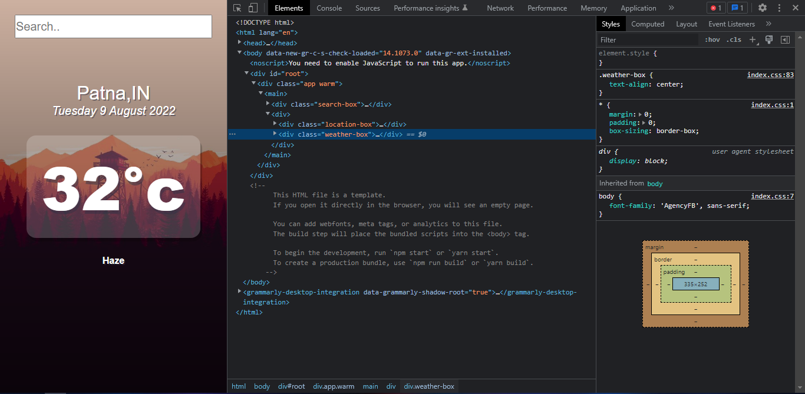
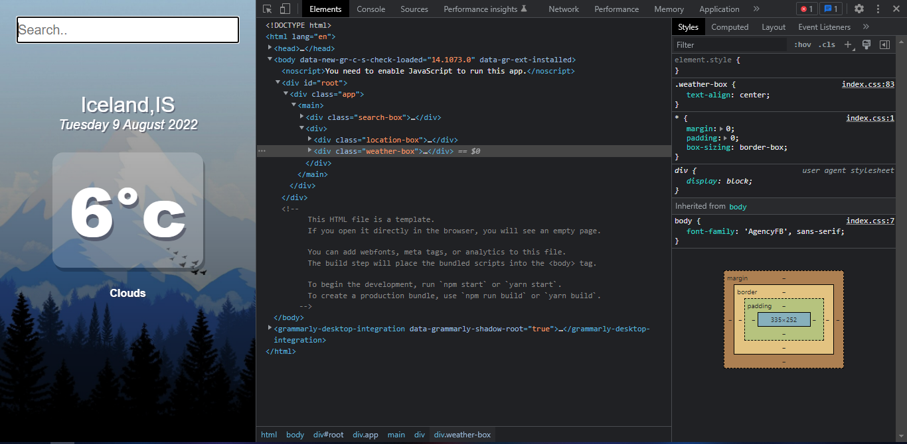

# React Weather App

This is a waether app using React ⚡

## Note:
To run this project you need to first use `npm intall` command as i haven't uploaded node modules folder. By using `npm install`, node modules folder will be downloaded to your folder then you can use the below npm scripts.

## Available Scripts

In the project directory, you can run:

### `npm start`

Runs the app in the development mode.\
Open [http://localhost:3000](http://localhost:3000) to view it in the browser.

The page will reload if you make edits.\
You will also see any lint errors in the console.

### `npm test`

Launches the test runner in the interactive watch mode.\

### `npm build`

Builds the app for production to the `build` folder.\
It correctly bundles React in production mode and optimizes the build for the best performance.

## Output:

